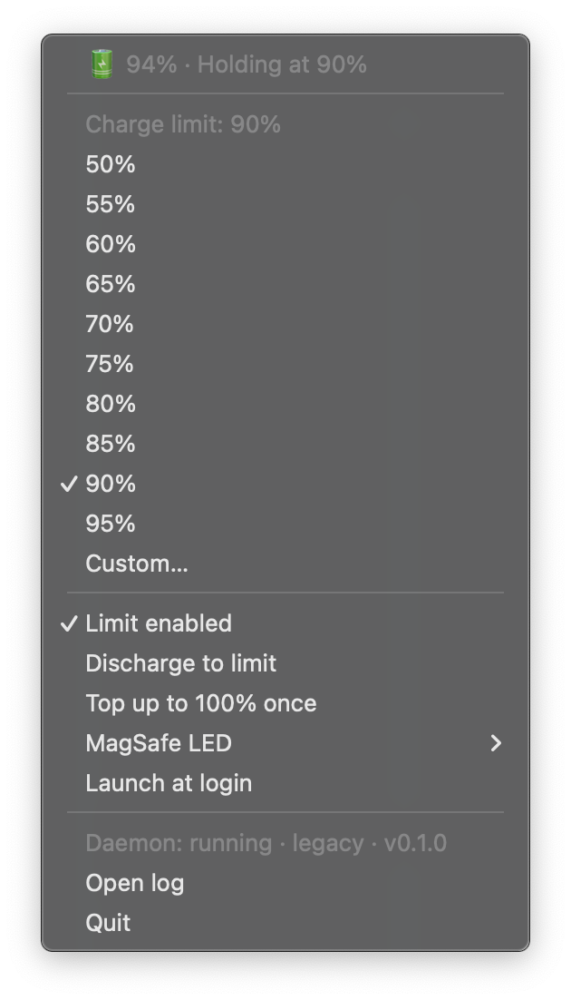
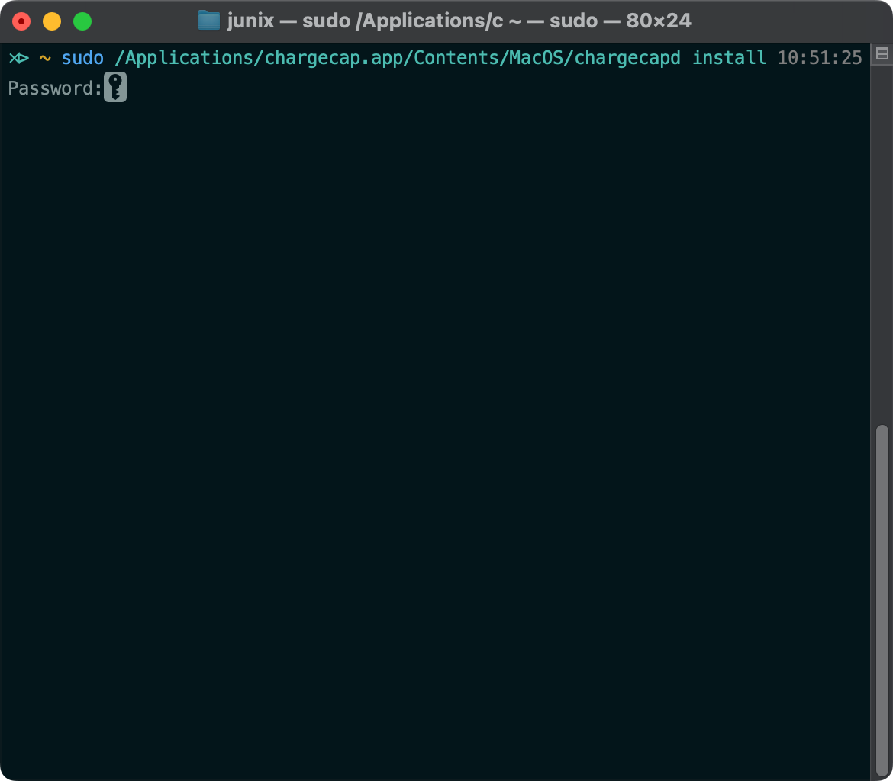
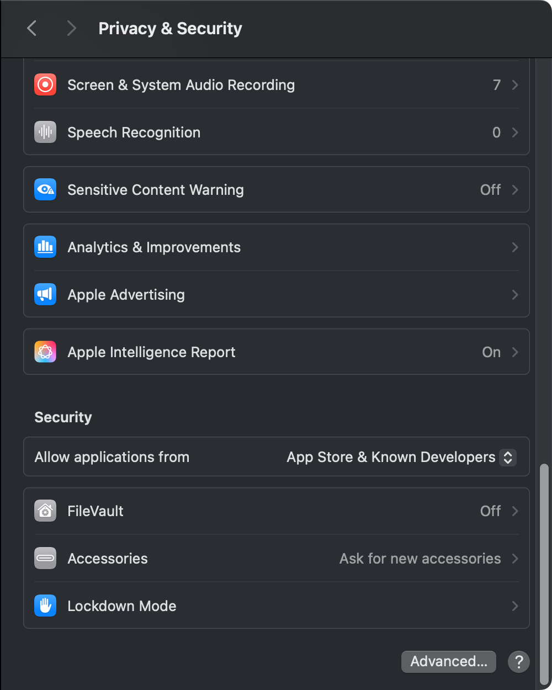

<p align="center">
  <!-- TODO: replace with the real app icon (256×256 PNG) -->
  
</p>

<h1 align="center">chargecap</h1>

<p align="center">
  A tiny menu-bar app that stops your MacBook from charging past 80%,<br>
  so your battery stays healthy for years instead of months.
</p>

<p align="center">
  <a href="https://github.com/junixdev/chargecap/releases/latest"></a>
  <a href="https://github.com/junixdev/chargecap/actions/workflows/ci.yml"></a>
  <a href="LICENSE"></a>
  
  
  
</p>

<p align="center">
  <!-- TODO: screenshot of the open menu, roughly 600px wide -->
  
</p>

---

## Why would I want this?

Lithium batteries wear out fastest when they sit at 100% for a long time.
If your MacBook lives on a desk and stays plugged in most of the day, it is
spending most of its life in exactly that state.

chargecap fixes that. It quietly stops charging when the battery reaches
your chosen limit (80% by default) and lets it drift down a couple of points
before topping it up again. Your Mac stays plugged in, your battery stays in
its comfort zone, and you never have to think about it.

When you actually need a full charge, for a long flight for example, one
click tells chargecap to fill up to 100% just this once.

## Features

- **Set a limit in one click.** Pick 50% to 95% in 5% steps, or type your own.
- **Top up to 100% once.** Charge fully for a trip, then go back to the limit automatically.
- **Discharge to the limit.** Already at 100%? Let it drain down to your limit while plugged in.
- **Turn it off any time.** Untick "Limit enabled" and your Mac charges normally.
- **MagSafe light control.** Keep the system behaviour, switch the light off, or make it show real charging state.
- **Launch at login.** Set it once and forget it.
- **Survives sleep and restarts.** The limit is enforced by a small background helper, not just the menu.
- **Light and native.** Written in Rust, no Electron, no accounts, no network access, no telemetry.

## Requirements

| | |
|---|---|
| **Mac** | Any MacBook with an Apple Silicon chip (M1, M2, M3, M4 or later) |
| **macOS** | Sonoma 14 or later |
| **Admin password** | Needed once, during install, to set up the background helper |

> **Intel Macs are not supported.** They control charging in a different way,
> and chargecap does not include code for them.

## Install

### 1. Download

Grab the latest `chargecap-…-apple-silicon.zip` from the
[**Releases page**](https://github.com/junixdev/chargecap/releases/latest)
and double-click it to unzip. You will get `chargecap.app`.

### 2. Move it to Applications

Drag `chargecap.app` into your **Applications** folder.

<!-- TODO: screenshot or short GIF of dragging the app into Applications -->
<p align="center"></p>

### 3. Set up the background helper (one time)

Charging is controlled by a chip inside your Mac that only an administrator
can talk to. chargecap includes a small helper that does this for you, and
it needs to be installed once.

Open **Terminal** (press `⌘ Space`, type `Terminal`, press Return), paste
this line, and press Return. Type your Mac password when asked. Nothing
appears as you type, which is normal.

```sh
sudo /Applications/chargecap.app/Contents/MacOS/chargecapd install
```

<!-- TODO: screenshot of Terminal showing the install command and its output -->
<p align="center"></p>

### 4. Open chargecap

Open `chargecap.app` from your Applications folder. The first time, macOS
may say it cannot check the app for malware, because chargecap is signed by
its developer and not by Apple. That is expected. To open it anyway:

1. **Right-click** (or Control-click) `chargecap.app` and choose **Open**.
2. Click **Open** again in the dialog.

If macOS still refuses, go to **System Settings → Privacy & Security**,
scroll down, and click **Open Anyway** next to chargecap.

<!-- TODO: screenshot of the Privacy & Security "Open Anyway" button -->
<p align="center"></p>

A battery percentage appears in your menu bar. You are done!

> **Prefer to build it yourself?** See [CONTRIBUTING.md](CONTRIBUTING.md).
> From a checkout, `scripts/install.sh` does all four steps above.

## Using chargecap

Click the percentage in your menu bar to open the menu.

<!-- TODO: annotated screenshot of the menu with numbered callouts -->
<p align="center"></p>

| Menu item | What it does |
|---|---|
| **Status line** | Shows the battery level and what chargecap is doing right now, for example "Holding at 80%". |
| **50% … 95%** | Pick the level where charging should stop. 80% is a good everyday choice. |
| **Custom…** | Type any whole number from 50 to 100. |
| **Limit enabled** | Untick to charge normally to 100%. Tick again to go back to your last limit. |
| **Discharge to limit** | Pauses power from the charger so the battery drains down to your limit, then resumes. Handy right after you enable a limit on a full battery. |
| **Top up to 100% once** | Charges all the way to 100% one time, then goes back to enforcing your limit. Untick it to cancel early. |
| **MagSafe LED** | **System** keeps Apple's behaviour. **Off** turns the light off. **Reflect charging** shows amber while charging and green when holding. |
| **Launch at login** | Starts chargecap automatically when you log in. |
| **Open log** | Opens the helper's log file, useful if something looks wrong. |
| **Quit** | Closes the menu-bar app. The limit keeps working in the background. |

### What the menu-bar icon means

| You see | Meaning |
|---|---|
| `78% ↑` | Plugged in and charging towards your limit |
| `80% ■` | Plugged in and holding at your limit |
| `76% ↓` | Discharging down to your limit |
| `85% ↑ 100` | Topping up to 100% once |
| `93% ∞` | Limit is off, charging normally |
| `64%` | Running on battery |
| `⚠︎` | The background helper is not running (see below) |

## Uninstall

1. Quit chargecap from its menu.
2. Open **Terminal** and run this line. It removes the helper and returns
   your Mac to normal charging:

   ```sh
   sudo /usr/local/libexec/chargecapd uninstall
   ```

3. Drag `chargecap.app` from Applications to the Trash.

Your saved limit is kept in case you reinstall. To remove it too, delete
`/Library/Application Support/chargecap` and
`~/Library/Application Support/chargecap`.

If you installed from a checkout, `scripts/uninstall.sh` does all of this
for you. Add `--purge` to remove the saved settings as well.

## Help and troubleshooting

**The menu bar shows `⚠︎` or "Daemon not running".**
The background helper is not running. Run step 3 of the install again:

```sh
sudo /Applications/chargecap.app/Contents/MacOS/chargecapd install
```

**My Mac charged past the limit.**
Check that **Limit enabled** is ticked and **Top up to 100% once** is not.
If both look right, open the log from the menu and
[open an issue](https://github.com/junixdev/chargecap/issues/new/choose)
with the last few lines.

**My Mac will not charge at all after uninstalling.**
Run the uninstall command above once more. It resets the charging switch
as part of removing the helper.

**Where are the files?**

| What | Where |
|---|---|
| Background helper | `/usr/local/libexec/chargecapd` |
| Helper log | `/Library/Logs/chargecap/daemon.log` |
| Saved limit | `/Library/Application Support/chargecap/config.json` |
| App settings | `~/Library/Application Support/chargecap/app.json` |

Still stuck? Please [open an issue](https://github.com/junixdev/chargecap/issues/new/choose).
Include your Mac model and macOS version, and we will help you sort it out.

## How it works (the short version)

Apple Silicon Macs have a chip called the SMC that decides whether the
battery is allowed to charge. chargecap has two parts:

- **The menu-bar app** you click on. It never touches the hardware.
- **A tiny background helper** (`chargecapd`) that watches the battery level
  and flips the SMC's charging switch on and off. It needs administrator
  rights, which is why install asks for your password once.

The app and the helper talk to each other over a private local connection.
No data ever leaves your Mac.

Curious about the details, or want to contribute? Head over to
[CONTRIBUTING.md](CONTRIBUTING.md). A real-hardware test run is written up
in [docs/VERIFICATION.md](docs/VERIFICATION.md).

## Contributing

Bug reports, ideas and pull requests are very welcome. Please read
[CONTRIBUTING.md](CONTRIBUTING.md) for the build steps and
[CODE_OF_CONDUCT.md](CODE_OF_CONDUCT.md) for how we treat each other.
Found a security problem? See [SECURITY.md](SECURITY.md).

## License

chargecap is free and open source under the [MIT License](LICENSE).
Copyright © 2026 Junix Villacorta.

---

<p align="center">
  Made with ❤️ for MacBooks that never leave the desk.<br>
  <sub>chargecap is not affiliated with or endorsed by Apple Inc. MagSafe and macOS are trademarks of Apple Inc.</sub>
</p>
